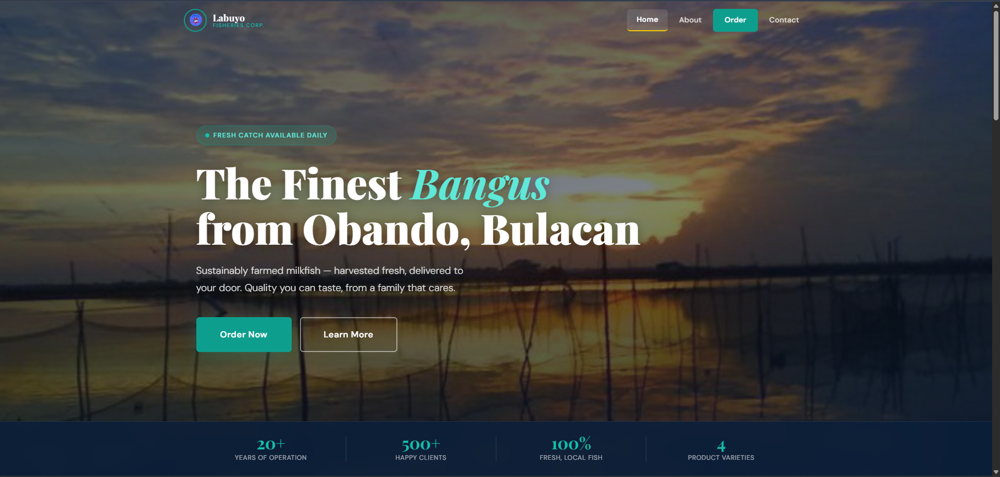

# Labuyo Fisheries Corp. 🐟

 

A responsive, dynamic web application built for a local aquaculture business based in Obando, Bulacan. Labuyo Fisheries Corp. specializes in delivering sustainably farmed, premium *Bangus* (milkfish) directly to consumers.

This project was developed with a "Coastal Filipino" aesthetic, utilizing deep navy, warm sand, and fresh teal color palettes to reflect the brand's heritage and commitment to quality.

## ✨ Features

* **Dynamic Templating:** Utilizes PHP for efficient component rendering (Header, Footer, Navigation) across multiple pages.
* **Responsive Design:** Fully fluid CSS grid and flexbox layouts that adapt seamlessly from desktop to mobile screens.
* **Interactive UI:** Custom-built vanilla JavaScript components including a mobile hamburger menu, sticky scroll effects, and active-state routing.
* **Product Showcase:** Clean, organized presentation of product varieties (Fresh, Deboned, Smoked, Marinated Daing).
* **Form Interfaces:** Structured front-end layouts for Order processing and Contact inquiries.

## 🛠️ Tech Stack

* **Backend / Routing:** PHP 8.x
* **Frontend:** HTML5, CSS3 (Custom variables, Grid, Flexbox)
* **Scripting:** Vanilla JavaScript
* **Typography:** Playfair Display (Headings) & DM Sans (Body)

## 📂 Project Structure

```text
labuyo-fisheries/
├── assets/
│   ├── style.css       # Global styling & variables
│   ├── home.css        # Hero and homepage specific styles
│   ├── about.css       # Story and values grid styles
│   ├── order.css       # Form layout and sidebar styles
│   └── contact.css     # Contact card and layout styles
├── images/             # Local image assets
├── includes/
│   ├── header.php      # Dynamic navigation and head metadata
│   └── footer.php      # Global footer component
├── index.php           # Landing Page
├── about.php           # Our Story Page
├── order.php           # Order Interface
├── contact.php         # Contact Information
└── schema.sql       # database schema for ordering system database
